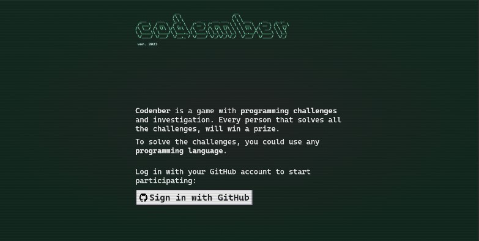

<h1><a href="https://codember.dev/" target="_blank">Codember</a></h1>

<div align="center"><a href="https://codember.dev/" target="_blank"></a></div>

<h3>TypeScript solved challenges</h3>

<h5>Codember, a <a href="https://github.com/midudev" target="_blank">@midudev</a> project</h5>

---

### CHALLENGES

```console
$ ls
CHANGELOG.txt
CHALLENGE_01.txt
CHALLENGE_02.txt
data
private 🔐
```

##### CHALLENGE 1

```console
$ cat CHALLENGE_01.txt

** The Challenge **
A spy is sending encrypted messages.

Your mission is to create a program that decodes the messages.

The messages are words separated by spaces like this:
cat dog dog car Cat doG sun

We need the program to return the number of times each word appears in the message, regardless of whether it is in uppercase or lowercase.

The result will be a text string with the word and the number of times it appears in the message, in this format:
cat2dog3car1sun1

The words are sorted by their first appearance in the message!

** More Examples: **
keys house HOUSE house keys -> keys2house3
cup te a cup -> cup2te1a1
houses house housess -> houses1house1housess1

** How to Solve It **
1. Solve the message you will find in this file: https://codember.dev/data/message_01.txt

2. Submit your solution with the "submit" command in the terminal, for example like this:
submit dog3cat3car1sun1
```